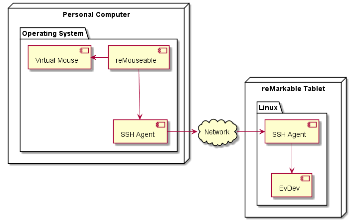
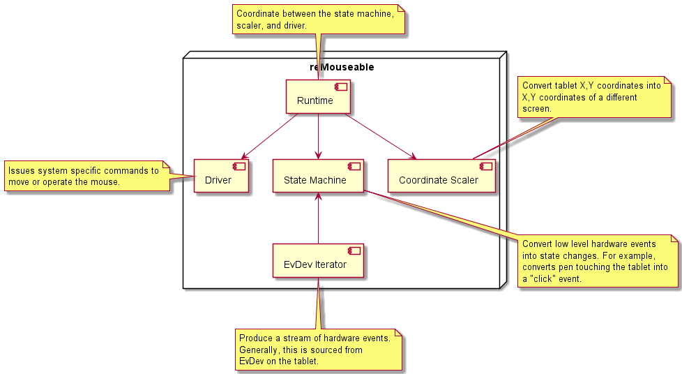
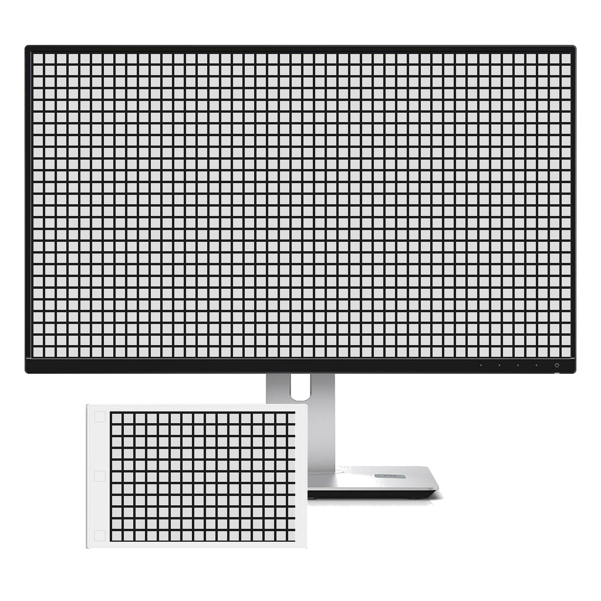

# reMouseable Design Documentation

This document details how reMouseable works, the rationale for the software
design choices, and suggestions for folks looking to make modifications.

- [reMouseable Design Documentation](#remouseable-design-documentation)
	- [Overview](#overview)
	- [The Tablet](#the-tablet)
	- [The Iterator](#the-iterator)
		- [Iterator Interface](#iterator-interface)
		- [EvDev](#evdev)
		- [Bulk Event Filtering](#bulk-event-filtering)
	- [The State Machine](#the-state-machine)
		- [State Machine Interface](#state-machine-interface)
		- [Interpreting Hardware Events](#interpreting-hardware-events)
	- [The Position Scaler](#the-position-scaler)
		- [Default Height And Width Of A Tablet](#default-height-and-width-of-a-tablet)
		- [Matching Orientation Example](#matching-orientation-example)
	- [The Driver](#the-driver)
		- [The Driver Interface](#the-driver-interface)
		- [RobotGo And Mouse Controls](#robotgo-and-mouse-controls)
	- [The Runtime](#the-runtime)
	- [Ideas For Modifications](#ideas-for-modifications)
		- [Modifying SSH Access To Tablet](#modifying-ssh-access-to-tablet)
		- [Loading Hardware Events From Non-Tablet Sources](#loading-hardware-events-from-non-tablet-sources)
		- [Monitor Selection](#monitor-selection)
		- [Supporting More Than Left Click](#supporting-more-than-left-click)
		- [Supporting Non-Mouse Key Presses](#supporting-non-mouse-key-presses)
		- [Adding New Pen Buttons Or Features](#adding-new-pen-buttons-or-features)
		- [Full Wacom Support](#full-wacom-support)

## Overview



reMouseable uses SSH to connect to a tablet and copy over hardware events. The
hardware events are then translated into operating system specific commands that
move and operate the mouse.



Within the reMouseable code are several components: the iterator, the state
machine, the position scaler, the driver, and the runtime. Each has a
specialized purpose and design that is detailed below. Each can be modified or
re-implemented to get new or different behaviours from reMouseable.

## The Tablet

(As of 2021-12-01) There are two versions of the reMarkable tablet available:
the reMarkable v1 and reMarkable v2. The hardware configurations are slightly
different between versions but the underlying software that is relevant to
reMouseable is virtually identical across versions.

Despite the specialized purpose for which reMarkable tablets are built and used,
each tablet is a general purpose computing device running a Linux operating
system which makes them quite "hackable". The tablets run a custom Linux
distribution called "Codex" and the source code is available at
<https://github.com/reMarkable/linux>. Each tablet ships with SSH support and
the root password is available in the "about" section of the tablet interface.

reMouseable works by connecting to the tablet over SSH and copying over the
contents of a special kind of file that produces hardware events. This means
that reMousable does not need to modify any part of the tablet system and only
copies data from the tablet to the target machine in order to then process the
hardware data.

## The Iterator

The first and "lowest level" component in the reMouseable design is the EvDev
Iterator. This component is responsible for sourcing hardware events and
presenting them as an infinite stream that can be processed by the rest of the
reMouseable system. When running reMouseable from the pre-compiled binaries, the
EvDev iterator is the only component that directly interacts with the reMarkable
tablet (or other Linux device).

### Iterator Interface

```golang
type EvdevIterator interface {
	// Next progresses the iterator. It returns false when there are no more
	// elements to iterate or when the iterator encountered an error.
	Next() bool
	// Current returns the active element of the iterator. This should only be
	// called if Next() returned a true.
	Current() EvdevEvent
	// Close must be called before discarding the iterator. If the iterator
	// exited cleanly then the error is nil. The error is non-nil if either the
	// iterator encountered an internal error and stopped early or if it failed
	// to close.
	Close() error
}
```

Implementations of this interface provide the system with an infinite stream
of Linux hardware events. These hardware events are common across all Linux
systems and not specific to the reMarkable tablet. The events produced by the
iterator match this structure:

```golang
type EvdevEvent struct {
	// Time of the event
	Time time.Time
	// Type identifies the category of event.
	Type uint16
	// Code identifies a specific kind of event within a category.
	Code uint16
	// Numeric value of the event. Dependent on the event type.
	Value int32
}
```

The default implementation of this, available in `pkg/evdeviterator.go`,
consumes raw binary data from a readable stream and parses the binary into the
event structure. The input stream is always set to an EvDev character device
when running the pre-compiled binaries.

### EvDev

[EvDev](https://en.wikipedia.org/wiki/Evdev) stands for "event device" and is
a Linux feature that allows userspace applications to read and write input
events that are typically generated by hardware input devices such as a keyboard
or mouse.

The `Type` and `Code` values of the `EvdevEvent` from the previous section must
map to values from the EvDev symbol tables. These tables are maintained in `C`
code files that are accessible on Linux systems. In addition to a running Linux
machine, the
[input.h](https://github.com/torvalds/linux/blob/master/include/uapi/linux/input.h)
and
[input-event-codes.h](https://github.com/torvalds/linux/blob/master/include/uapi/linux/input-event-codes.h)
that contain the symbol tables are also available in the Linux source tree.

The reMouseable project generates Go representations of all EvDev symbols by
reading and parsing the Linux header files. The `pkg/internal/gencodes/main.go`
implements the header file parsing and Go code generation. The process generates
a file at `pkg/evdevcodes.go` which contains a full copy of all the EvDev types
and codes but as Go constant values that can be imported and referenced by other
Go code.

### Bulk Event Filtering

There are a lot of EvDev events that come through when monitoring the pen's
character device files (usually at `/dev/input/event0` or `/dev/input/event1`).
Most of those events are irrelevant and can cause latency between the tablet
and computer if emitted from the iterator. To help cut down on noise and latency
there is an included wrapper for EvDev iterator implementations in `pkg/evdeviterator.go`
called `SelectingEvdevIterator`. It can wrap any implementation and filter out
irrelevant event categories. The pre-compiled binaries use this feature to drop
all events other than those in the `EV_ABS` category which is discussed in more
detail with the state machine component.

## The State Machine

The second component in the reMouseable design is a state machine that consumes
the hardware event stream and converts those events into system state changes.
This component abstracts the raw, hardware events from the rest of the system
by converting sequences of hardware events into higher level system events.

### State Machine Interface

```golang
type StateMachine interface {
	// Next progresses the iterator. It returns false when there are no more
	// elements to iterate or when the iterator encountered an error.
	Next() bool
	// Current returns the active element of the iterator. This should only be
	// called if Next() returned a true.
	Current() StateChange
	// Close must be called before discarding the iterator. If the iterator
	// exited cleanly then the error is nil. The error is non-nil if either the
	// iterator encountered an internal error and stopped early or if it failed
	// to close.
	Close() error
}
```

Implementations of this interface provide the system with an infinite stream
of system state changes. These state changes are not specific to any given
operating system or hardware configuration. State change records emitted by
the state machine iterator match this interface:

```golang
type StateChange interface {
	Type() string
}
```

Each implementation of the `StateChange` interface represents a single state
and can contain additional metadata beyond the name. For example, a change in
the mouse position is signaled by emitting and instance of:

```golang
// StateChangeMove contains mouse movement data.
type StateChangeMove struct {
	X int
	Y int
}

// Type returns the specific change type.
func (*StateChangeMove) Type() string {
	return ChangeTypeMove
}
```

Consumers are expected to switch on the event type, unwrap the relevant struct
from the interface, and interpret the state and metadata. For example:

```golang
s := state.Current()
switch s.Type() {
case remouseable.ChangetypeMove:
    change := s.(*remouseable.StateChangeMove)
    fmt.Println(change.X, change.Y)
// ...
}
```

### Interpreting Hardware Events

The default implementation of the state machine interface that is used in the
pre-compiled binaries consumes and interprets the output of an EvDev iterator.

There are hundreds of EvDev event codes and dozens of event categories. Only a
subset of these are relevant to reMouseable. Specifically, the system only needs
to process events related to pen position in order to mirror that behavior in a
mouse. From an EvDev perspective, reMouseable processes events related to
absolute values which are in the category of `EV_ABS`. Within that category,
there are three significant codes: `ABS_X`, `ABS_Y`, and `ABS_PRESSURE`. The
X and Y values indicate the X and Y coordinates of the pen with `(0,0)` being
the bottom left-hand corner of the tablet when held vertically with the buttons
at the bottom. The pressure value indicates how close the pen is to the surface.

Pressure is a bit of a misnamed code because it can have a positive value
_before_ the pen touches the tablet. This allows the state machine to emit
"move" events even if the pen is not actively touching the tablet which allows
for a user to preview the mouse position before drawing. A pressure value of
`1000` is considered to indicate the pen is touching the tablet. Any value
greater means the pen is pressing into the tablet harder. Any value lesser means
the pen is hovering above the surface of the tablet. Damaged pens or tips may
report unpredictable values for pressure. A clear sign of this is a pen that
draws marks on the tablet without touching the surface.

## The Position Scaler

The position scaler maps coordinates from the tablet screen to coordinates on
the target screen.

The default state machine processes the `ABS_X` and `ABS_Y` hardware events
which provide the pen position a relative to the `(0,0)` origin. Coordinate
positions on a tablet, though, don't necessarily translate to coordinate
positions on the target screen because they usually have different physical
sizes, resolutions, and potentially different orientations. A position scaler
computes new coordinates for a target screen based on the tablet coordinates.

The default set of position scalers are in `pkg/positionscaler.go`. The
interface they implement is:

```golang
type PositionScaler interface {
	ScalePosition(x int, y int) (int, int)
}
```

The default scalers implement the interface by calculating the proportional
size difference of the screens and then applying that proportion to the
absolute `(X,Y)` coordinates from the tablet. From there, some scalers
optionally apply a translation to account for the difference in orientation
of the screens.

### Default Height And Width Of A Tablet

Target monitors report their own maximum X and Y values that are discovered
when starting reMouseable. The tablet, however, is not probed for size to keep
the interaction with the tablet OS as simple as possible. Instead, I found the
approximate maximum X and Y values for the tablet by printing EvDev `ABS_X` and
`ABS_Y` events out while drawing a line diagonally from the origin to the
opposite corner. I did this several times and captured the maximum values. The
approximate values are:

```
max_x = 15725
max_y = 20967
```

These values are likely not the _true_ maximum but are close enough that the
system operates as expected when scaled to a new screen.

### Matching Orientation Example

To illustrate scaling, let's consider two rectangular screens that are oriented
such that they are wider than they are tall. This is the most common screen
orientation for personal computers (wide screen) and is often the most common
orientation of the tablet because it matches the target screen.



The `(0,0)` origin of both screens is at the upper left-hand corner. However,
the two screens have different resolutions which means they can address a
different number of coordinates within their range. For this example, let's
assume the tablet is 100x200 and the monitor is 1000x2000. These are not the
true resolutions of either device but it makes the math a little easier to
follow.

A position scaler first determines the proportional height and width difference
between the screens:

```
height_tablet = 100
width_tablet = 200
height_monitor = 1000
width_monitor = 2000

scale_x = height_monitor / height_tablet = 10
scale_y = width_monitor / width_tablet = 10
```

This proportion, or ratio, is used to convert X and Y coordinates from the
tablet to X and Y coordinates on the monitor by multiplying tablet coordinates
with the scale. That is, a tablet coordinate of `(15,20)` is multiplied by
`(10,10)` to compute `(150,200)` as the appropriate position on the monitor. At
this scale, the mouse moves 10 times the number of points in any direction on
the monitor compared to the tablet.

This same scaling algorithm works when the tablet is at a higher resolution than
the monitor. See the `pgk/positionscaler.go` for documented variations of this
scaling algorithm that account for different orientations of the tablet.

## The Driver

The driver component manipulates the mouse of the host system. It is called
by the runtime when the state machine emits a change.

### The Driver Interface

```golang
type Driver interface {
	MoveMouse(x int, y int) error
	DragMouse(x int, y int) error
	Click() error
	Unclick() error
	GetSize() (width int, height int, err error)
}
```

The driver interface is intended to abstract the operating system methods needed
to run `remouseable`. It is currently limited to operating a mouse and detecting
the size of the host display.

### RobotGo And Mouse Controls

The current implementation of the driver is based on another project called
[robotgo](https://github.com/go-vgo/robotgo). `robotgo` is a collection of `C`
code that interfaces with operating system specific libraries for controlling
things like a mouse, keyboard, and display. The `C` code is wrapped in `Go` code
so that the operating system can be called by classes and methods in `Go`.

In order to limit the system and `C` dependencies required to build
`remouseable` I've embedded a portion of `robotgo` in the `pkg/internal/robotgo`
directory. In there, I've copied just enough to detect screen size and operate
a mouse. The `robotgo` project supports many more operating system features but
they require additional dependencies to build.

## The Runtime

The runtime component is the logic that brings together the state machine,
position scaler, and driver to create the `remouseable` experience. The main
implementation is available in `pkg/runtime.go`. It implements a similar
call pattern to the EvDev and state machine iterators. It is configured and
iterated over in the `main.go` at the root of the repository.

## Ideas For Modifications

Modifying `remouseable` behavior comes with varying levels of difficulty
depending on which of the behaviors you want to change. 

### Modifying SSH Access To Tablet

Lines 53 - 103 in `main.go` handle the SSH configuration and actual connection
to the tablet. If a password is given then it configures SSH using password
authentication. If no password is given then it attempts to call an SSH agent
running on the host. The assumption is that the SSH agent is configured with any
private keys that can be used to connect to the tablet.

There is no built-in support for using SSH keys without an SSH agent. However,
support for connecting using arbitrary keys could be added by modifying
`main.go`. My recommended approach for this is to first add a new CLI flag to
the set on lines 36 - 51 in `main.go` that will identify your key, such as
`--ssh-key`. Then add a new branch in the 53 - 103 range of lines that detects a
value for your new flag and will reconfigured the SSH client. Then use the
example from <https://pkg.go.dev/golang.org/x/crypto/ssh#example-PublicKeys> to
implement loading and using your private key.

Other SSH related changes can be made similarly.

### Loading Hardware Events From Non-Tablet Sources

One of the mistakes I made in the app is that generating the `io.Reader` of
hardware events that the [EvDev iterator](#evdev) needs is done in `main.go`
and without any kind of interface or factory that could be easily replaced.
It's locked into generating the `io.Reader` from the `STDOUT` of an SSH
connection that is running `cat` on the EvDev file.

One way to add support for alternative EvDev sources is to add more branches to
the `main.go` code that override the SSH connection behavior. Lines 86 - 103
are the ones that establish the SSH connection and generate the `io.Reader` as
a variable called `pipe`:

```golang
client, err := ssh.Dial("tcp", *sshIP, sshConfig)
if err != nil {
	panic(err)
}

sesh, err := client.NewSession()
if err != nil {
	panic(err)
}
defer sesh.Close()

pipe, err := sesh.StdoutPipe()
if err != nil {
	panic(err)
}
if err = sesh.Start(fmt.Sprintf("cat %s", *evtFile)); err != nil {
	panic(err)
}
```

These lines execute on every run of the app because they are not in a branch.
If you want to add alternative hardware event sources, such as a static file,
then you must wrap these lines in a branch of some kind that allows your
alternative source to override them. For example:

```golang
var eventSource io.ReadCloser
if *evdevFile != "" {
	// assuming evdevFile is a flag containing the path to the static file
	f, err := os.Open(*evdevFile)
	if err != nil {
		panic(err)
	}
	defer f.Close()
	eventSource = f
}
if eventSource == nil {
	// default to SSH
}
it := &remouseable.SelectingEvdevIterator{
	Wrapped: &remouseable.FileEvdevIterator{
		Source: eventSource,
	},
	Selection: []uint16{remouseable.EV_ABS},
}
defer it.Close()
```

If you want to support multiple, new sources of EvDev data then I'd recommend
creating some kind of interface for the constructor, or factory, of the
`io.Reader` so that the logic can be better tested rather than existing only
in the `main.go` file which has no real tests of its own.

### Monitor Selection

The monitor related portions of `robotgo` embedded in the project query the
operating system for the size of the screen. Operating systems all respond to
that query with a single size that represents _all_ connected monitors combined.
The result is that multi-monitor users must manually specify the size of their
main monitor using the `--screen-height` and `--screen-width` flags. Even using
those flags, though, multi-monitor users cannot specify which monitor to use
because the system is locked into using whatever the operating system considers
monitor 0 as the origin point.

The <https://github.com/Evidlo/remarkable_mouse> project has a strong advantage
here because the Python bindings for those same operating system calls are more
mature and offer more features. Specifically, the Python project uses
<https://github.com/rr-/screeninfo> to detect and select specific screens
instead of using one, large, combined screen. The most complete way to support
multi-monitor setups is to port the Python code that [generates lists of
monitors](https://github.com/rr-/screeninfo/blob/master/screeninfo/enumerators/windows.py)
to C so that this project can use it.

A possible alternative to this, [suggested by a
contributor](https://github.com/kevinconway/remouseable/issues/23), is to
provide manual selection of monitors by having the user input the correct
coordinate offsets so that `(0,0)` can be adjusted to the appropriate point in
the selected monitor. This could be done with a custom `PositionScaler` such as:

```golang
type OffsetPositionScaler struct {
	Wrapped PositionScaler
	OffsetX int
	OffsetY int
}
func (s *OffsetPositionScaler)  ScalePosition(x int, y int) (int, int) {
  x, y = s.Wrapped.ScalePosition(x, y)
  return x+s.OffsetX, y+s.OffsetY
}
```

This, in conjunction with the `--screen-height` and `--screen-width` options,
should correctly calculate the point position within the target monitor and then
shift it so that the new point is relative to the origin in the target monitor
rather than the combined monitors.

### Supporting More Than Left Click

One of the mistakes I made in designing the driver and the `Click`/`Unclick`
state machine events is that they both assume that only the primary, or left,
mouse button may be pressed. The underlying `robotgo` code supports left, right,
and center mouse buttons but those features are not exposed anywhere in the
`remouseable` code. If I were to rebuild `remouseable` then I'd most likely
refactor the code like:

```golang
// InputKey is an identifier for a system input. This is usually a hardware
// button of some kind.
type InputKey string

const (
	MouseLeft InputKey = "left"
	MouseRight InputKey = "right"
	MouseCenter InputKey = "center"
)

// StateChangePress replaces StateChangeClick so that it can identify
// more than just left click.
type StateChangePress struct{
	Key InputKey
}

// StateChangeRelease replaces StateChangeUnclick.
type StateChangeRelease struct{
	Key InputKey
}

type Driver interface {
	MoveMouse(x int, y int) error
	DragMouse(x int, y int) error
	Press(InputKey) error
	Release(InputKey) error
	GetSize() (width int, height int, err error)
}
```

This would add support for pressing more mouse buttons and add the space to
expand into non-mouse keys.

### Supporting Non-Mouse Key Presses

Assuming you implement something like the above to expand the available buttons
that can be pressed then there's an option to add non-mouse keys such as
keyboard keys. Unfortunately, this requires more effort than just mouse events
because it requires copying over and potentially modifying the [keyboard support
from robotgo](https://github.com/go-vgo/robotgo/tree/master/key).

The bulk of the work is in porting the `robotgo` feature. Beyond that, new keys
would become new entries in the `InputKey` enumeration:

```golang
type InputKey string

const (
	MouseLeft InputKey = "left"
	MouseRight InputKey = "right"
	MouseCenter InputKey = "center"
	KeyboardE InputKey = "e"
	KeyboardRightShift InputKey = "right_shift"
)
```

and the driver would be responsible for switching between the mouse and keyboard
devices on the host:

```golang
func (*RobotgoDriver) Press(k InputKey) error {
	switch k {
	case MouseLeft, MouseRight, MouseCenter:
		robotgo.MouseToggle("down", string(k))
	default:
		robotgo.KeyToggle(string(k), "down")
	}
	return nil
}

func (*RobotgoDriver) Release(k InputKey) error {
	switch k {
	case MouseLeft, MouseRight, MouseCenter:
		robotgo.MouseToggle("up", string(k))
	default:
		robotgo.KeyToggle(string(k), "up")
	}
	return nil
}
```

### Adding New Pen Buttons Or Features

The Remarkable 2 shipped with an optional pen that includes an eraser button.
Likewise, there are several 3rd party pens that offer erasers or other extra
buttons. As is, `remouseable` does not support any buttons other than the
writing tip of the pen. However, [a contributor figured out how the eraser
hardware events work and outlined how to add support in a
PR](https://github.com/kevinconway/remouseable/pull/26/files).

The general process of adding a new pen feature is:

- Identify the associated hardware code
- Determine if pressure is significant to the feature
- Add handling of the new hardware codes to the state machine

For example, [tominator1pl](https://github.com/tominator1pl) found that the
hardware event code for the eraser button being pressed on the official
Remarkable 2 markers is `BTN_TOOL_RUBBER`, or `0x141`, and that another key code
`BTN_TOOL_PEN`, or `0x140` is emitted when the eraser is lifted. Assuming that
pressure is not important and that a similar set of changes as suggested above have been made to the
driver and state machine then the new codes would be used like:

```golang
func (it *EvdevStateMachine) next(raw EvdevEvent) bool {
	if raw.Type == EV_KEY {
		switch raw.Code {
		case BTN_TOOL_RUBBER:
			it.clicked = true
			it.current = &StateChangePress{Key: MouseRight}
			return true
		case BTN_TOOL_PEN:
			it.clicked = false
			it.current = &StateChangeRelease{Key: MouseRight}
			return true
		}
	}
	// ...
```

Note that pressure may be important for this feature and _is_ used in
tominator1pl's fork where this feature is already implemented.

### Full Wacom Support

The tablet hardware events include things like pressure and tilt that map to the
same events from Wacom style tablets. Unfortunately, pressure sensitivity and
tilt are difficult to implement as `remouseable` features.

Today, the tool works by consuming a stream of pen events from the Linux system
on the tablet and translating some of them into mouse events on the computer.
Each operating system has a different interface and different set of libraries
that must be used to control the mouse. This project embeds some C code, copied
from <https://github.com/go-vgo/robotgo>, that handles the OS specific mouse
operations. Click, release, move, and drag are the only mouse operations that
map to pen movement so it's not much code needed to support Windows, OSX, and
Linux together. The limitation with this method is that the tool can only do
what the mouse does and a mouse doesn't have tilt or pressure features.

To act as a full tablet interface to the host machine, the `remouseable` app
would need to communicate with the operating system as a wacom style device
rather than a mouse. Even though the remarkable tablet is doing exactly this
internally, it's not easy or simple to mirror a tablet device across computers.
I've researched this idea a bit to see how it might be done and my best guess is
that it is only made possible by implementing a custom device driver for each
OS. That device driver would need to translate the Linux device events from the
remarkable into OS specific hardware events that match up with that OS's
expectations for a pen or wacom style tablet.

If you're using Linux then the Linux to Linux translation is possible.
<https://github.com/Evidlo/remarkable_mouse> is a Python project that works
almost identically to this one but also supports the full pen feature set on
Linux when you use the `--evdev` flag. They're able to accomplish this because
there is an open source Python module for creating Linux device drivers and the
Linux device events coming from the remarkable are exactly the same ones the
driver needs to emit. There is no equivalent Go module for creating Linux device
drivers which is why `remouseable` doesn't already have this feature. To
implement this in `remouseable`, you would need to port the relevant Python code
to Go. Note that <https://github.com/gvalkov/golang-evdev> exists and was used
for this project but it only supports reading from devices. It cannot create or
write to them. This is the feature that must be ported from the Python EvDev
library.

There may be an easier way to accomplish full tablet usage but this is all the
information I've been able to find and learn on the subject. Here are some links
to operating system specific information about device drivers, virtual devices,
and tablet controls that might be useful to anyone implementing this feature:

- Resources for Windows
  - https://docs.microsoft.com/en-us/windows-hardware/design/component-guidelines/legacy-touchscreen-and-pen-resources
  - https://docs.microsoft.com/en-us/windows-hardware/design/component-guidelines/pen-devices
  - https://docs.microsoft.com/en-us/windows-hardware/drivers/ddi/

- Resources for OSX
  - https://developer.apple.com/documentation/driverkit/creating_a_driver_using_the_driverkit_sdk

- Resources for Linux
  - https://github.com/Evidlo/remarkable_mouse/blob/master/remarkable_mouse/evdev.py
  - https://github.com/gvalkov/python-evdev

- Resources for cross platform
  - https://github.com/OpenTabletDriver/OpenTabletDriver

